# Scenarios

Situations that came up while reviewing and hardening the browser tab source (Phase 4 follow-up). Each one has the steps, the expected result and a sequence diagram of what happens between the parts.

Audio behavior cannot be checked by automated tests. Run these by hand and tick the status when confirmed. Add a new section here whenever a new situation is handled.

Setup for all of them: `pnpm tauri dev`, the extension loaded in Chrome and paired, a browser tab picked as the music source and playing. The engine log is printed to the terminal.

After rebuilding the extension (`pnpm -C extension build`): press reload on its card in `chrome://extensions`, then reload the music tab.

## Status

| # | Scenario | Commit | Status |
|---|---|---|---|
| 1 | Link lost while Cricket has paused the music | `c876eaf` | Confirmed by hand |
| 2 | Link lost while playing | `c876eaf` | Confirmed by hand |
| 3 | User pauses during the outage | `c876eaf` | Confirmed by hand |
| 4 | Cricket switched off during the outage | `c876eaf` | Confirmed by hand |
| 5 | App killed mid-fade | `df5a2dc` | Confirmed by hand |
| 6 | Quit from the tray mid-fade | `df5a2dc` | Reported good with the others, not itemised |
| 7 | Extension disconnects mid-fade | `df5a2dc` | Reported good with the others, not itemised |
| 8 | User changes the volume after the app died | `df5a2dc` | Reported good with the others, not itemised |
| 9 | Browser fully restarted | `815aaf4` | **Not tested** |
| 10 | Cricket restarted, browser left running | `815aaf4` | **Not tested** |
| 11 | Extension reloaded | `815aaf4` | **Not tested** |
| 12 | Music tab closed, browser still running | `815aaf4` | Seen once, wording changed since: **retest** |
| 13 | Extension reloaded but the music tab not reloaded | none (known limitation) | Seen once |
| 14 | Tab on a site that is not allowed | `d15f02a` | **Not tested** |
| 15 | Allow a site from the popup | `d15f02a` | **Not tested** |
| 16 | Remove an allowed site | `d15f02a` | **Not tested** |
| 17 | Desktop app source is unchanged | all | Confirmed by hand after `c876eaf` only |

---

## 1. Link lost while Cricket has paused the music

Steps: play another sound until Cricket pauses the tab. Disable the extension in `chrome://extensions`. Stop the other sound. Wait longer than the resume cooldown. Re-enable the extension.

Expected: the status says "Waiting for the browser tab", the state stays `PausedByCricket`, the log has no "resume had no effect". After the extension is back and the cooldown has passed, the music resumes at its original volume.

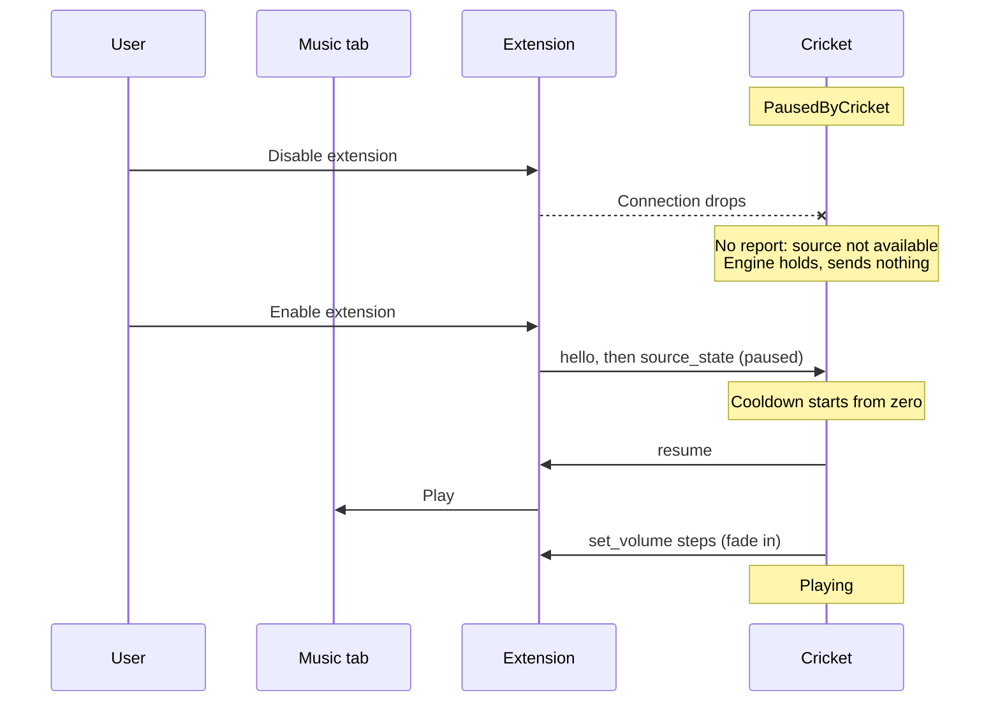

## 2. Link lost while playing

Steps: with the music playing and nothing else making sound, disable the extension for about 10 seconds, then enable it. Play another sound.

Expected: the state stays `Playing` during the outage, not `PausedByUser`. Afterwards Cricket pauses the tab as usual.

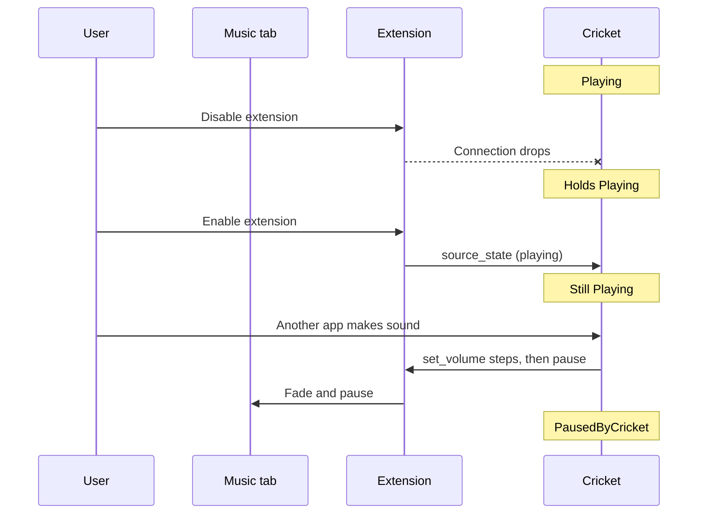

## 3. User pauses during the outage

Steps: disable the extension, pause the music by hand in the tab, enable the extension.

Expected: the state goes to `PausedByUser`. Cricket does not restart the music.

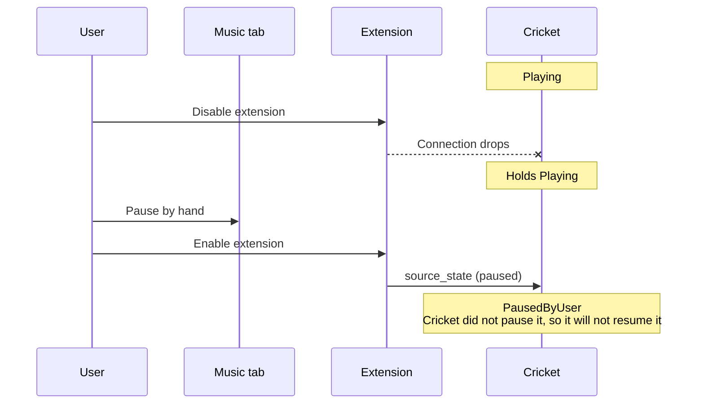

## 4. Cricket switched off during the outage

Steps: disable the extension, then turn Cricket off in the window.

Expected: the state goes to `Idle`.

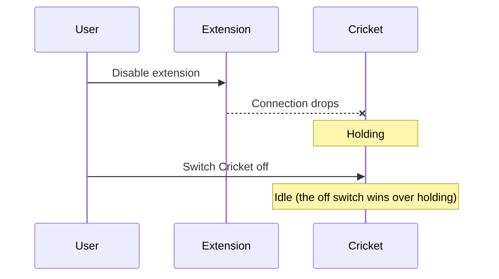

## 5. App killed mid-fade

Steps: start another sound so the tab begins to fade out. During the fade, end `cricket.exe` in Task Manager.

Expected: within about 5 seconds the tab is back at its original volume.

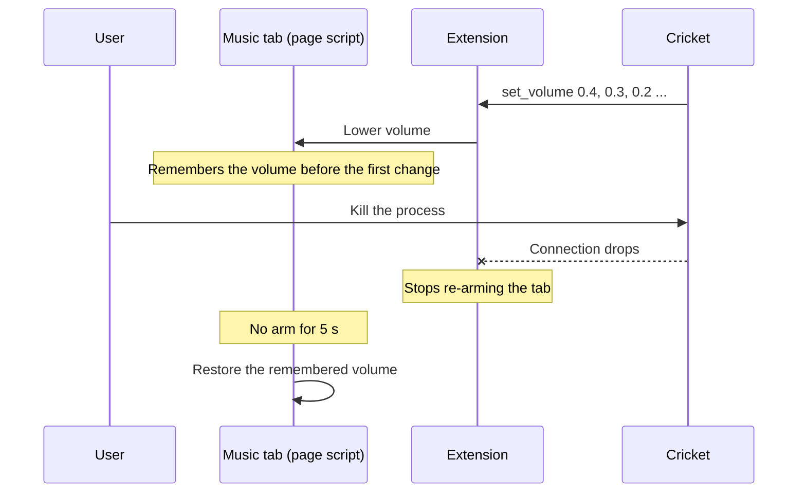

## 6. Quit from the tray mid-fade

Steps: trigger a fade and choose Quit from the tray during it.

Expected: the tab is back at its original volume right away.

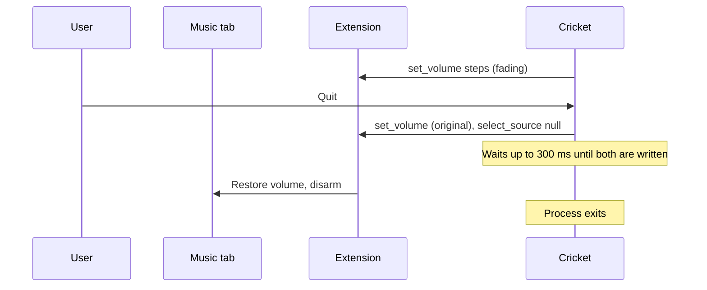

## 7. Extension disconnects mid-fade

Steps: trigger a fade and disable the extension during it.

Expected: the tab is back at its original volume within about 5 seconds. If the extension comes back while the other sound is still playing, the volume steps down once and the fade carries on from where the engine was.

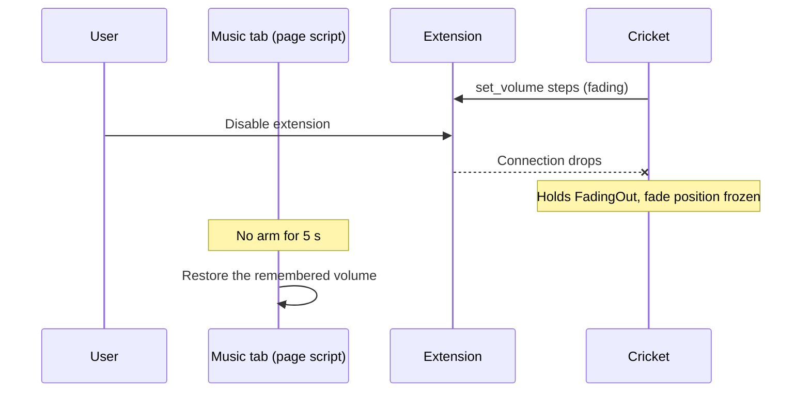

## 8. User changes the volume after the app died

Steps: kill the app mid-fade and at once move the player's volume slider.

Expected: the volume stays where the user put it. It is not overwritten 5 seconds later.

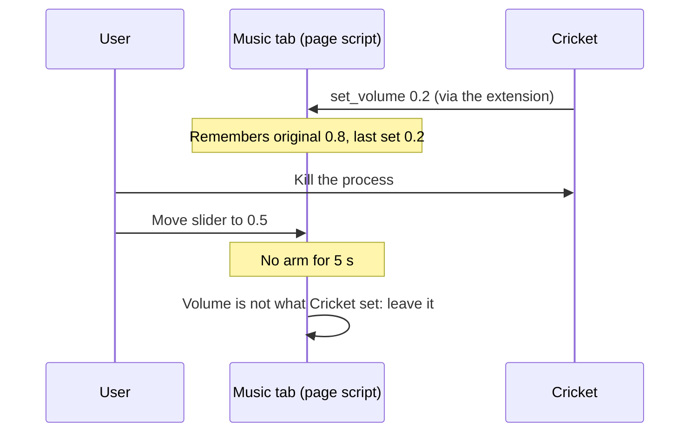

## 9. Browser fully restarted

Chrome must really exit. Closing the window is not enough if Chrome keeps running in the background: turn off "Continue running background apps when Google Chrome is closed" in `chrome://settings/system`, or use Exit on Chrome's tray icon.

Steps: with a tab picked, exit Chrome completely and open it again with several tabs. Play another sound.

Expected: Cricket shows "Pick your tab again". No tab is marked as selected. No tab is paused or faded. After picking the music tab again, Cricket controls it normally.

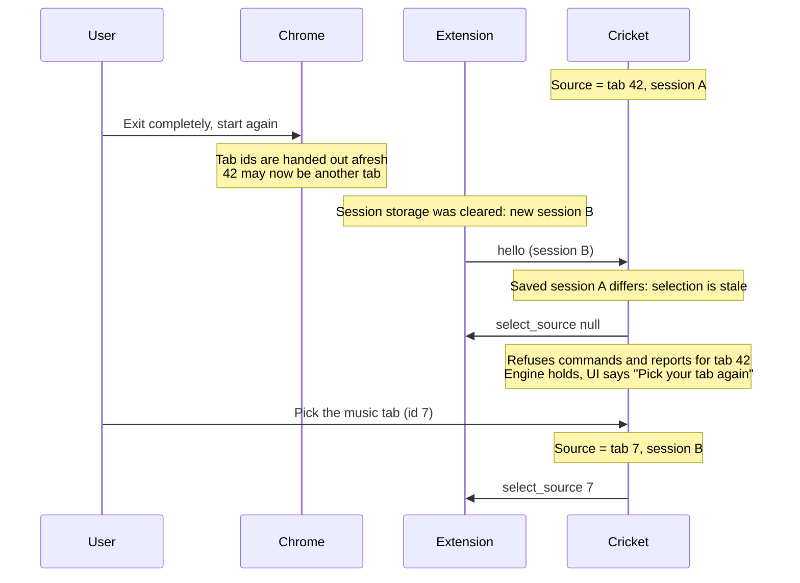

## 10. Cricket restarted, browser left running

Steps: with a tab picked and Chrome left open, quit Cricket from the tray and start it again.

Expected: the same tab is still the source. No need to pick again.

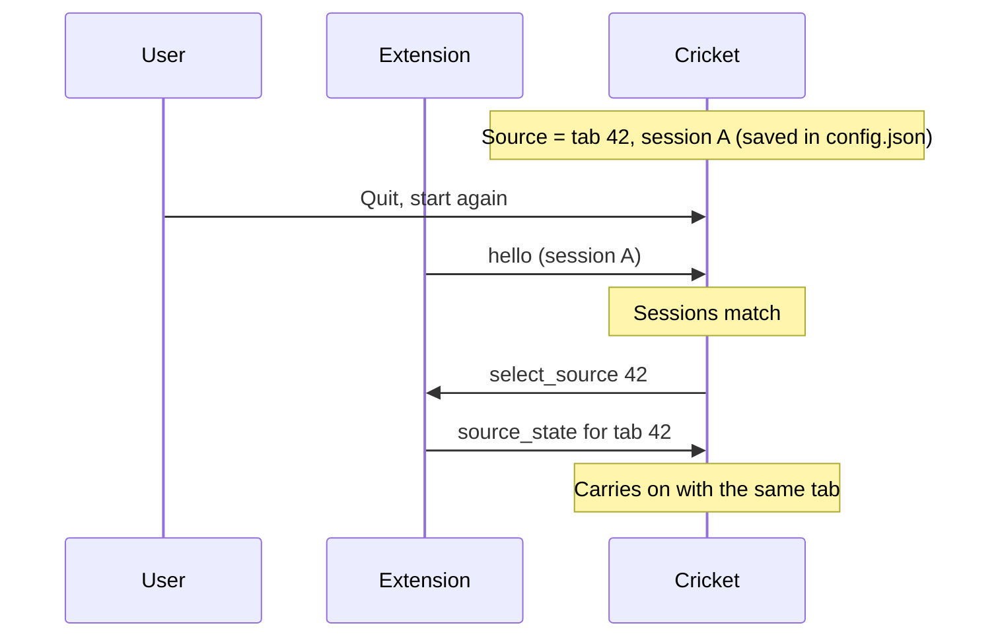

## 11. Extension reloaded

Steps: press reload on the extension's card.

Expected: "Pick your tab again", the same as a browser restart, because reloading the extension clears its session storage. A known cost of the tab-id fix. The music tab also has to be reloaded, see scenario 13.

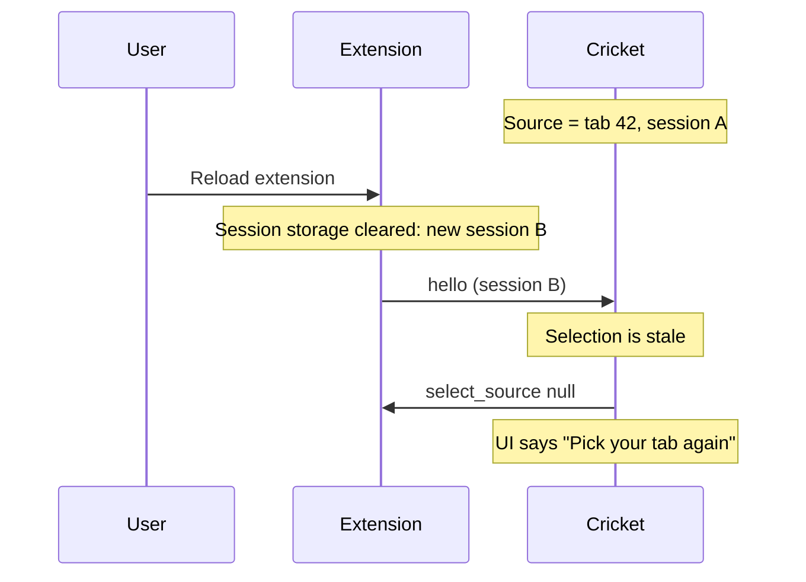

## 12. Music tab closed, browser still running

Steps: close the music tab. Optionally reopen it (Ctrl+Shift+T).

Expected: the status says "The music tab was closed" and asks to pick the tab again. Nothing is paused or faded. The reopened tab has a new id and counts as another tab making sound until it is picked.

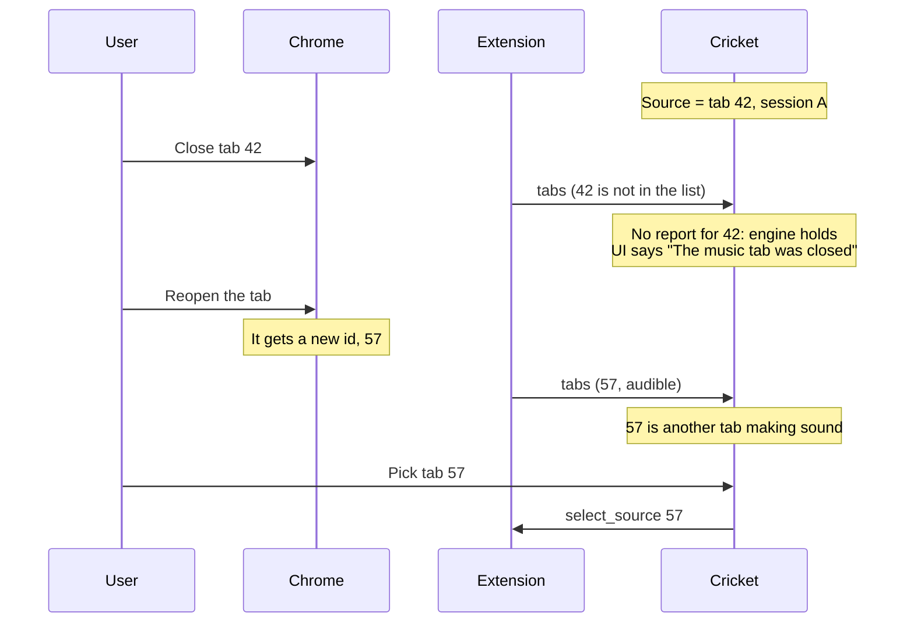

## 13. Extension reloaded but the music tab not reloaded

Known limitation, not fixed. Reloading the extension cuts off the scripts already injected into open pages.

Steps: reload the extension, do not reload the music tab, pick the tab, play another sound.

Observed: the log repeats `COMMAND pause` and "pause had no effect" every two seconds, with "paused without a fade", and both sounds play. Reloading the music tab fixes it.

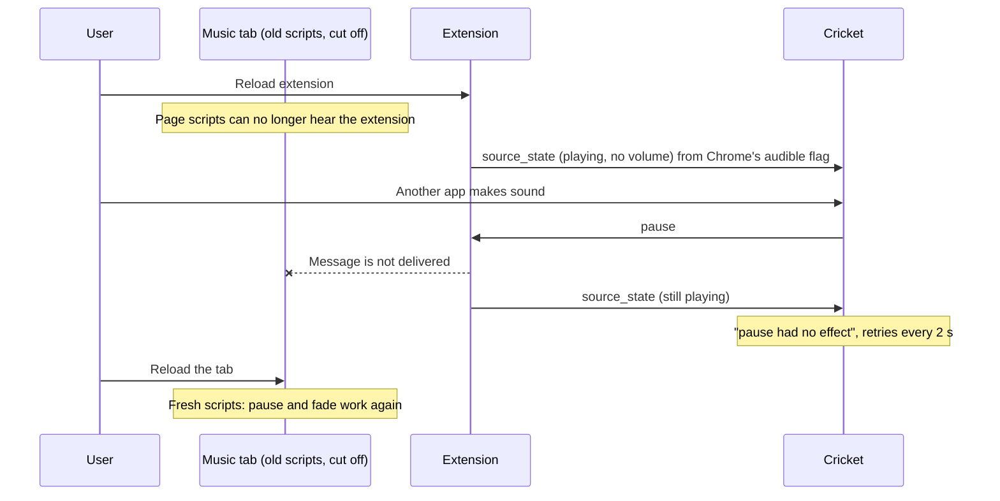

## 14. Tab on a site that is not allowed

Steps: open a tab that plays audio on a site outside the default list in `extension/manifest.json`. Look at Cricket's source list. Play sound in that tab while an allowed tab is the source.

Expected: the tab says "allow the site first" and cannot be picked. Its sound still makes Cricket pause the music.

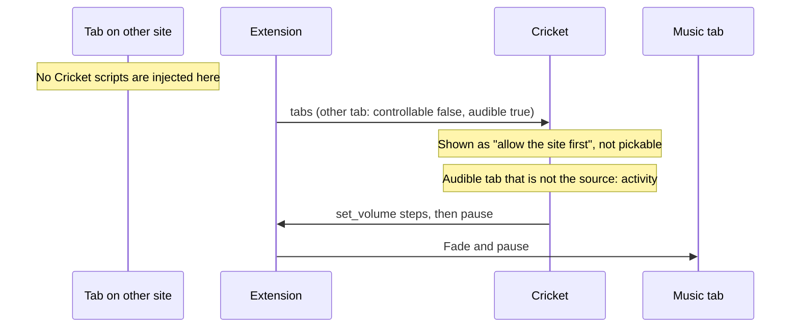

## 15. Allow a site from the popup

Steps: on that tab, click the Cricket icon and press "Allow Cricket on <site>". Accept Chrome's prompt. Pick the tab in Cricket and run a pause and resume cycle.

Expected: the popup says the site is allowed, the tab becomes pickable, pause and resume work. If the player does not respond, reload the tab once.

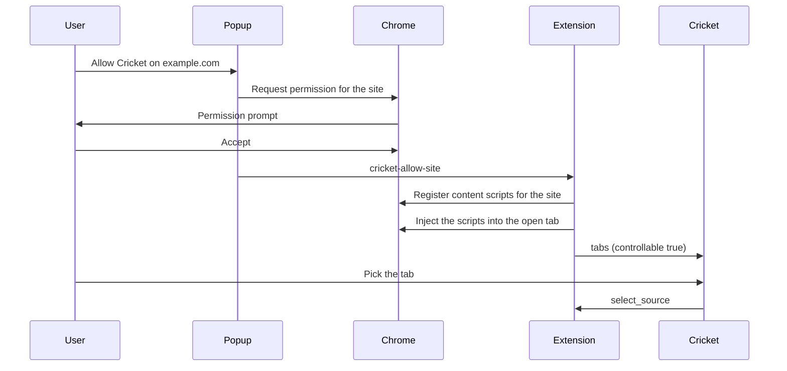

## 16. Remove an allowed site

Steps: in the popup, open "Allowed sites" and press Remove.

Expected: the tab goes back to "allow the site first" in Cricket.

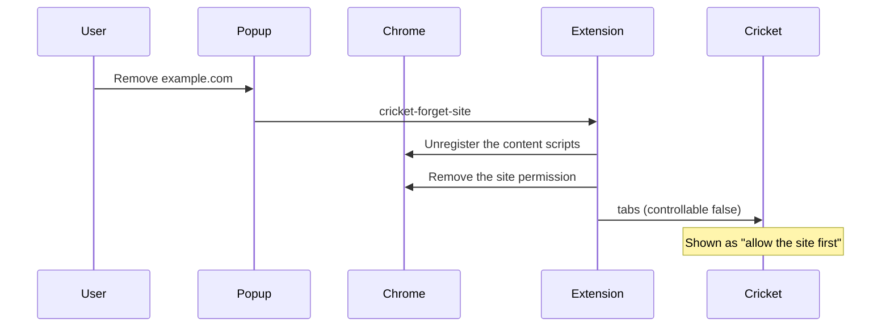

## 17. Desktop app source is unchanged

Steps: switch the source to a desktop app such as Spotify and run a normal pause and resume cycle. Repeat after each of the commits above.

Expected: the same behavior as before these changes. A desktop app is always "available"; holding only applies to tabs.

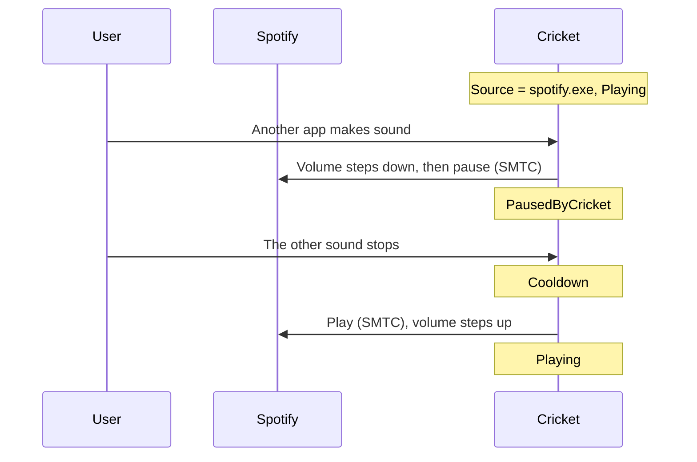
